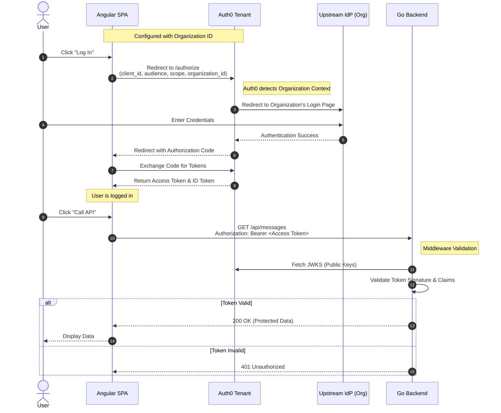

# System Architecture & Data Flow (Phase 1)

## High-Level Architecture
This diagram illustrates the components of the Federated Authentication MVP and their interactions.

```mermaid
graph TD
    subgraph "Client Workstation"
        User[User]
        Browser[Web Browser]
        Angular[Angular SPA]
    end

    subgraph "Docker Host"
        Nginx[Nginx Container]
        GoAPI[Go Backend API]
    end

    subgraph "External Services"
        Auth0[Auth0 Tenant]
        Terraform[Terraform Cloud/Local]
    end

    subgraph "Identity Providers"
        UpstreamIdP[Test Business IdP\n(Simulated LDAP)]
    end

    %% Relationships
    User -->|Accesses| Browser
    Browser -->|Loads App| Nginx
    Browser -- Runs --> Angular
    
    Angular -->|1. Login (OIDC)| Auth0
    Auth0 -->|2. Federate| UpstreamIdP
    
    Angular -->|3. API Request (Bearer Token)| GoAPI
    GoAPI -->|4. Validate Token (JWKS)| Auth0
    
    Terraform -->|Configures| Auth0
```

## Authentication & API Sequence Flow
This sequence diagram details the "Business Users Only" login flow and subsequent protected API access.



## Component Details

### 1. Frontend (Angular)
- **Role**: Single Page Application serving the UI.
- **Auth SDK**: `@auth0/auth0-angular`.
- **Configuration**:
  - `domain`: `dev-bnik.us.auth0.com`
  - `audience`: `https://fedauthoneapi/`
  - `organization`: `org_...` (Hardcoded for Phase 1)
- **Hosting**: Served via Nginx in a Docker container.

### 2. Backend (Go)
- **Role**: Protected Resource Server.
- **Framework**: Gin Web Framework.
- **Middleware**: Custom middleware using `github.com/auth0/go-jwt-middleware/v2`.
- **Validation**: Validates JWTs against Auth0's JSON Web Key Set (JWKS).

### 3. Auth0 (Broker)
- **Role**: Central Federation Broker.
- **Resources Managed**:
  - **API**: Represents the Go Backend.
  - **Application**: Represents the Angular Frontend.
  - **Organization**: Represents the customer ("Test Business").
  - **Connection**: The link to the Upstream IdP.

### 4. Infrastructure
- **Docker Compose**: Orchestrates the local runtime environment.
- **Terraform**: Provisions and manages the Auth0 Organization and Connection resources to ensure reproducibility.
