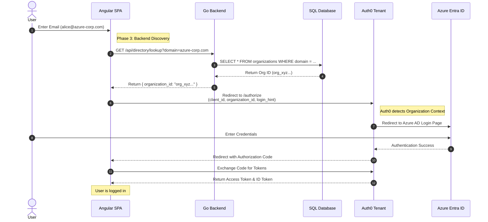

# System Architecture & Data Flow (Phase 3)

## High-Level Architecture
This diagram illustrates the production-ready architecture with Backend Discovery and Real IdP Integration.

```mermaid
graph TD
    subgraph "Client Workstation"
        User[User]
        Browser[Web Browser]
        Angular[Angular SPA]
    end

    subgraph "Docker Host"
        Nginx[Nginx Container]
        GoAPI[Go Backend API]
        SQL[Azure SQL Edge]
    end

    subgraph "External Services"
        Auth0[Auth0 Tenant]
        AzureAD[Azure Entra ID\n(Real IdP)]
        Terraform[Terraform Cloud/Local]
    end

    %% Relationships
    User -->|Accesses| Browser
    Browser -->|Loads App| Nginx
    Browser -- Runs --> Angular
    
    Angular -->|1. Lookup Org (Email Domain)| GoAPI
    GoAPI -->|2. Query Domain| SQL
    SQL -- Returns Org ID --> GoAPI
    GoAPI -- Returns Org ID --> Angular

    Angular -->|3. Login (OIDC + Org ID)| Auth0
    Auth0 -->|4. Federate| AzureAD
    
    Angular -->|5. API Request (Bearer Token)| GoAPI
    GoAPI -->|6. Validate Token (JWKS)| Auth0
    
    Terraform -->|Configures| Auth0
```

## Authentication & API Sequence Flow
This sequence diagram details the "Dynamic Discovery" login flow.



## Component Details

### 1. Frontend (Angular)
- **Role**: Single Page Application serving the UI.
- **Auth SDK**: `@auth0/auth0-angular`.
- **Logic**: `LoginComponent` extracts email domain and calls Backend API for discovery.
- **Hosting**: Served via Nginx in a Docker container.

### 2. Backend (Go)
- **Role**: Protected Resource Server & Directory Service.
- **Framework**: Gin Web Framework.
- **Database**: GORM with Azure SQL Edge.
- **Endpoints**:
  - `GET /api/directory/lookup`: Public endpoint for Org Discovery.
  - `GET /api/messages`: Protected endpoint requiring JWT.
- **Middleware**: CORS and Auth0 JWT Validation.

### 3. Database (Azure SQL Edge)
- **Role**: Stores Organization mappings.
- **Schema**: `Organizations` table (Domain -> Auth0 Org ID).
- **Management**: Auto-migrated and seeded by the Go Backend on startup.

### 4. Auth0 (Broker)
- **Role**: Central Federation Broker.
- **Resources Managed**:
  - **Organizations**: One per B2B customer (e.g., "Real Azure Corp").
  - **Connections**: "waad" (Azure AD) and "auth0" (Simulated).
  - **Policies**: Signups disabled for B2B connections.

### 5. Infrastructure
- **Docker Compose**: Orchestrates Frontend, Backend, and SQL Server.
- **Terraform**: Provisions Auth0 resources (Orgs, Connections, Users) and manages secrets via `terraform.tfvars`.
