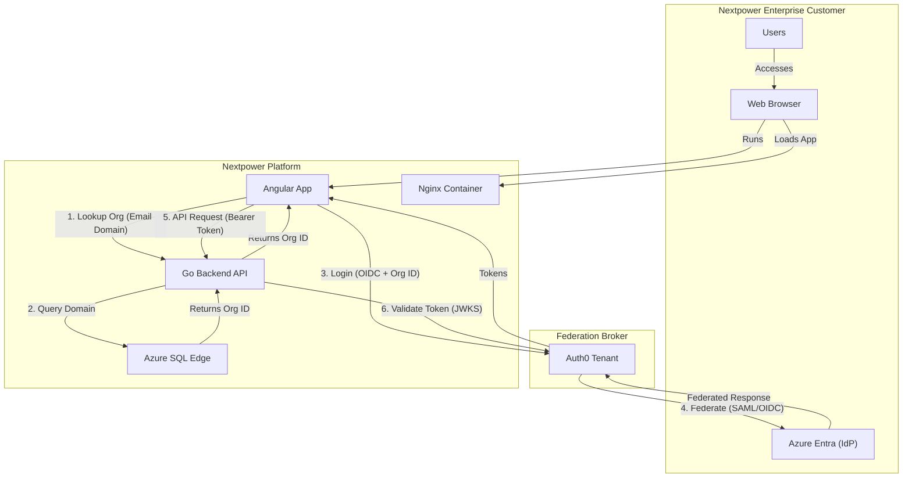
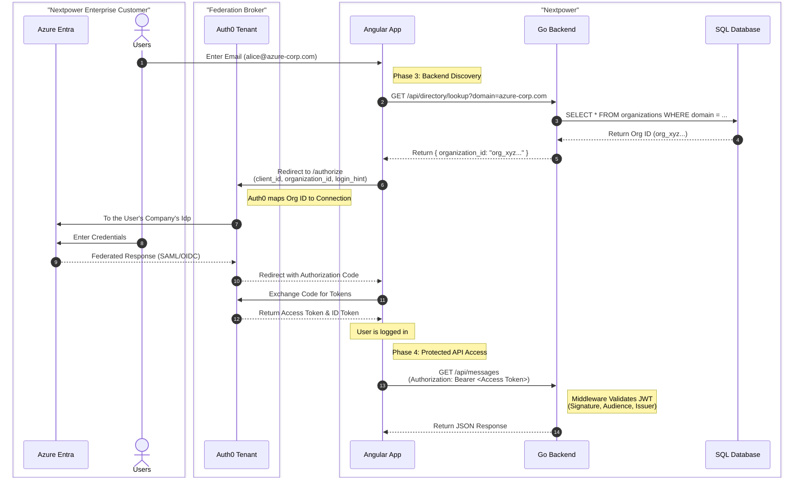

# System Architecture & Data Flow (Phase 3)

## High-Level Architecture
This diagram illustrates the production-ready architecture with Backend Discovery and Real IdP Integration.

## Authentication & API Sequence Flow
## Authentication & API Sequence Flow
This sequence diagram details the **"Dynamic Discovery"** login flow with a **"No Prompt"** experience for Business Users.

### Workflow Description
1.  **Organization Discovery**: The user enters their email (e.g., `alice@azure-corp.com`). The Angular App calls the Nextpower API to lookup the `organization_id` associated with that domain.
2.  **Direct Federation (No Prompt)**: The Angular App initiates the Auth0 login, passing the `organization_id` explicitly.
    *   *Configuration*: The Auth0 Application is configured for **"Business Users"** (Team Members) only.
    *   *Experience*: Auth0 skips the Universal Login prompt and immediately redirects the user to their configured Identity Provider (Azure Entra).
3.  **Authentication**: The user authenticates with their corporate credentials at Azure Entra.
4.  **Token Issuance**: Azure Entra returns a SAML/OIDC response to Auth0. Auth0 issues an OIDC Access Token and ID Token to the Angular App.
5.  **Protected Access**: The Angular App uses the Access Token to call the protected Go Backend API. The Backend validates the token against Auth0's JWKS.

## Component Details

### 1. Frontend (Angular)
- **Role**: Single Page Application serving the UI.
- **Auth SDK**: `@auth0/auth0-angular`.
- **Logic**: `LoginComponent` extracts email domain and calls Backend API for discovery.
- **Hosting**: Served via Nginx in a Docker container.

### 2. Backend (Go)
- **Role**: Protected Resource Server & Directory Service.
- **Framework**: Gin Web Framework.
- **Database**: GORM with Azure SQL Edge.
- **Endpoints**:
  - `GET /api/directory/lookup`: Public endpoint for Org Discovery.
  - `GET /api/messages`: Protected endpoint requiring JWT.
- **Middleware**: CORS and Auth0 JWT Validation.

### 3. Database (Azure SQL Edge)
- **Role**: Stores Organization mappings.
- **Schema**: `Organizations` table (Domain -> Auth0 Org ID).
- **Management**: Auto-migrated and seeded by the Go Backend on startup.

### 4. Auth0 (Broker)
- **Role**: Central Federation Broker.
- **Application Settings**:
  - **Login Experience**: "Business Users" (Users must be a member of an organization).
  - **Prompt**: "No Prompt" (Application passes `organization` parameter to skip Auth0 selection screen).
- **Resources Managed**:
  - **Organizations**: One per B2B customer (e.g., "Real Azure Corp").
  - **Connections**: "waad" (Azure AD) and "auth0" (Simulated).
  - **Policies**: Signups disabled for B2B connections.

### 5. Infrastructure
- **Docker Compose**: Orchestrates Frontend, Backend, and SQL Server.
- **Terraform**: Provisions Auth0 resources (Orgs, Connections, Users) and manages secrets via `terraform.tfvars`.
